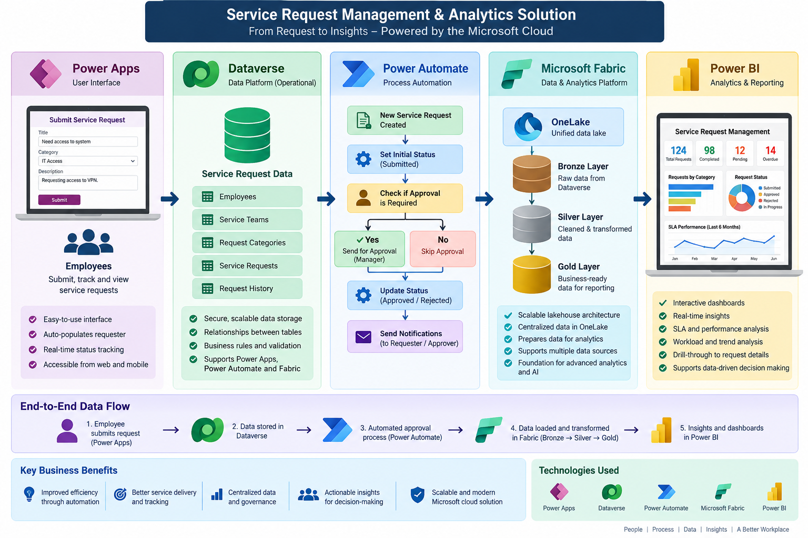

# Service Request Management & Analytics Platform

An end-to-end **Employee Service Request Management & Analytics Platform** built with **Power Apps, Dataverse, Power Automate, Microsoft Fabric, and Power BI**.

The project demonstrates a complete business process from **employee request submission → operational data → automated approval → analytical data engineering → business intelligence**.

## Architecture



### End-to-End Flow

**Power Apps → Dataverse → Power Automate → Microsoft Fabric → Power BI**

1. **Power Apps** – Employees submit and track service requests.
2. **Dataverse** – Stores operational service request data and related entities.
3. **Power Automate** – Automates SLA processing, manager lookup, approvals, status updates and notifications.
4. **Microsoft Fabric** – Transforms operational data through a Bronze → Silver → Gold architecture.
5. **Power BI** – Provides dashboards, KPIs, SLA analysis, workload analysis and request-level insights.

---

## Business Problem

Internal service requests can become difficult to manage when they rely on disconnected emails, spreadsheets and manual processes. This can make it difficult to track requests, route approvals, monitor SLAs, maintain an audit trail and produce reliable management reports.

This project demonstrates a centralized and automated approach.

## Solution Objectives

- Provide a simple employee request interface.
- Centralize operational data in Dataverse.
- Automate approval workflows.
- Calculate and track SLA due dates.
- Capture approval decisions, comments and dates.
- Build a scalable analytical architecture in Microsoft Fabric.
- Deliver actionable insights through Power BI.

## Microsoft Technologies

| Technology | Purpose |
|---|---|
| **Power Apps** | Employee-facing service request application |
| **Dataverse** | Operational system of record and relational data platform |
| **Power Automate** | Workflow automation, approvals, SLA and status management |
| **Microsoft Fabric** | Data engineering and analytical platform |
| **Power BI** | Reporting, dashboards and business intelligence |

## Dataverse Data Model

The solution contains five primary tables:

- **Employees** – employee identity, email, role, active status and manager ID.
- **Service Teams** – service-team ownership and assignment information.
- **Request Categories** – categories, default SLA hours, approval requirement and service team.
- **Service Requests** – request ID, requester, category, priority, description, status, SLA and approval information.
- **Request History** – historical information associated with service requests.

## Power Apps

The application provides an employee-facing interface for:

- Submitting service requests
- Automatically identifying the logged-in requester
- Viewing submitted requests
- Accessing manager approval functionality

## Power Automate Workflow

When a new Service Request is created:

```text
New Service Request
        ↓
Set Initial Status = Submitted
        ↓
Retrieve Service Request
        ↓
Set Approval Status = Pending
        ↓
Check Approval Requirement
        ↓
Retrieve Requester / Manager
        ↓
Send Approval Request
        ↓
Approve or Reject
        ↓
Capture Approval Comments
        ↓
Capture Approval Date
        ↓
Update Service Request Status
```

The approval process was tested successfully for both **Approved** and **Rejected** outcomes.

## SLA Management

Request Categories contain a configurable **Default SLA Hours** value. The workflow uses this information to populate the **SLA Due Date**.

Example:

**IT Access → 24-hour SLA**

## Microsoft Fabric Analytics

The analytical architecture follows the Medallion pattern:

```text
Dataverse
    ↓
Bronze — Raw / Landing
    ↓
Silver — Cleaned / Standardized
    ↓
Gold — Business-Ready
    ↓
Power BI — Reporting & Insights
```

The Gold layer contains business-ready fact and dimension structures optimized for reporting.

## Power BI

The reporting solution includes:

- **Service Request Management Dashboard**
- **SLA & Performance Dashboard**
- **Request & Workload Analysis**
- **Request Details Drill-through**

## Key Features

- Employee service request submission
- Automatic requester identification
- Relational Dataverse data model
- Category-driven SLA calculation
- Manager-based approval routing
- Approve/Reject workflow
- Approval comments and approval date capture
- Request status management
- Bronze/Silver/Gold analytical architecture
- Power BI dashboards and drill-through

## Testing

| Scenario | Result |
|---|---|
| Submit Service Request | ✅ Passed |
| Initial status = Submitted | ✅ Passed |
| SLA Due Date populated | ✅ Passed |
| Manager approval triggered | ✅ Passed |
| Approve | ✅ Passed |
| Reject | ✅ Passed |
| Approval comments captured | ✅ Passed |
| Approval date captured | ✅ Passed |
| Final status updated in Dataverse | ✅ Passed |

## Key Technical Challenges

- Configured Dataverse lookup display/search behavior in Power Apps.
- Resolved Employee ID versus Dataverse GUID data-type differences.
- Implemented manager retrieval using the employee ID text value.
- Used a valid Microsoft 365 tenant identity for approval routing.
- Used the Service Request unique identifier for Dataverse updates.
- Resolved stale Power Automate dynamic-content references.

## Business Value

The solution demonstrates how Microsoft technologies can be combined to:

- Reduce manual request processing
- Improve approval turnaround
- Increase request visibility
- Improve SLA monitoring
- Strengthen process traceability
- Centralize operational and analytical data
- Provide actionable management insight

## Future Enhancements

- Automated requester notifications
- SLA escalation and reminders
- Exception handling for missing/inactive managers
- Role-based security
- Enhanced request-history tracking
- Power Automate error monitoring
- Development/Test/Production ALM
- Managed solutions and deployment pipelines
- Advanced analytics and SLA-risk prediction

## Skills Demonstrated

**Business Analysis:** requirements analysis, process mapping, workflow design

**Application Development:** Power Apps, Dataverse, Power Fx, relational data modeling

**Automation:** Power Automate, approval workflows, dynamic content, SLA automation

**Data Engineering:** Microsoft Fabric, OneLake, Bronze/Silver/Gold architecture, transformations, fact/dimension modeling

**Business Intelligence:** Power BI, KPI development, data modeling, SLA analytics, drill-through reporting


## Technology Tags

`Power Apps` `Dataverse` `Power Automate` `Microsoft Fabric` `OneLake` `Power BI` `Power Fx` `Data Engineering` `Business Intelligence` `Workflow Automation` `Medallion Architecture`

---

**Project:** Service Request Management & Analytics Platform  
**Purpose:** Portfolio / Interview Demonstration  
**Architecture:** Power Apps → Dataverse → Power Automate → Microsoft Fabric → Power BI
